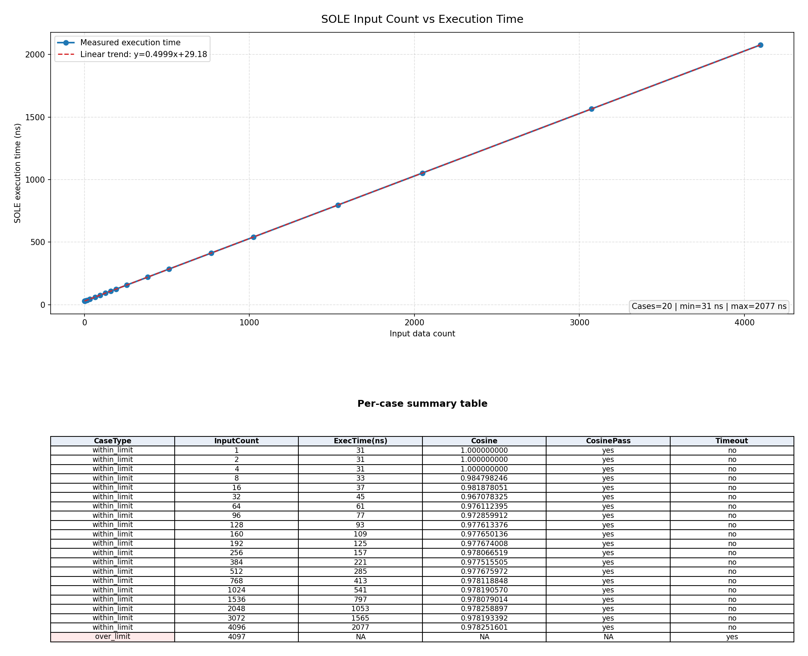

# SOLE Softmax Timing Report (Auto Generated)

Generated at: 2026-03-28 21:21:36 CST

## Test Configuration
- Testbench: test/SOLE_test.cpp
- Timeout macro: MAX_TIMEOUT_CYCLES=10000
- Build before run: 0
- Cosine pass threshold: > 0.95
- Tested counts: 1 2 4 8 16 32 64 96 128 160 192 256 384 512 768 1024 1536 2048 3072 4096

## Summary
- Total cases: 20
- Cosine > 0.95 cases: 20
- Timeout cases within 1..4096 sweep: 0

## Per-Case Results
Legend: 🟠 Input Count/Execution Time | 🟢 Pass | 🔴 Fail

```text
InputCount   ExecutionTime(ns)    CosineSimilarity     CosineCheck    Timeout   
------------ -------------------- -------------------- -------------- ----------
🟠 1          🟠 31                 1.000000000          🟢 PASS         🟢 NO      
🟠 2          🟠 31                 1.000000000          🟢 PASS         🟢 NO      
🟠 4          🟠 31                 1.000000000          🟢 PASS         🟢 NO      
🟠 8          🟠 33                 0.984798246          🟢 PASS         🟢 NO      
🟠 16         🟠 37                 0.981878051          🟢 PASS         🟢 NO      
🟠 32         🟠 45                 0.967078325          🟢 PASS         🟢 NO      
🟠 64         🟠 61                 0.976112395          🟢 PASS         🟢 NO      
🟠 96         🟠 77                 0.972859912          🟢 PASS         🟢 NO      
🟠 128        🟠 93                 0.977613376          🟢 PASS         🟢 NO      
🟠 160        🟠 109                0.977650136          🟢 PASS         🟢 NO      
🟠 192        🟠 125                0.977674008          🟢 PASS         🟢 NO      
🟠 256        🟠 157                0.978066519          🟢 PASS         🟢 NO      
🟠 384        🟠 221                0.977515505          🟢 PASS         🟢 NO      
🟠 512        🟠 285                0.977675972          🟢 PASS         🟢 NO      
🟠 768        🟠 413                0.978118848          🟢 PASS         🟢 NO      
🟠 1024       🟠 541                0.978190570          🟢 PASS         🟢 NO      
🟠 1536       🟠 797                0.978079014          🟢 PASS         🟢 NO      
🟠 2048       🟠 1053               0.978258897          🟢 PASS         🟢 NO      
🟠 3072       🟠 1565               0.978193392          🟢 PASS         🟢 NO      
🟠 4096       🟠 2077               0.978251601          🟢 PASS         🟢 NO      
```

## Input Count vs Execution Time



Plot status: Plot generated successfully

## Over-limit Check (>4096)
```text
InputCount   ExecutionTime(ns)    CosineSimilarity     CosineCheck    Timeout   
------------ -------------------- -------------------- -------------- ----------
🟠 4097       🟠 NA                 NA                   ⚪ N/A          🔴 YES     
```

Conclusion: input count > 4096 triggers timeout in this run.

## Artifacts
- CSV: test/SOLE_Execution_Time_TEST/softmax_exec_time_results.csv
- Over-limit CSV: test/SOLE_Execution_Time_TEST/softmax_overlimit_result.csv
- Plot data TXT: test/SOLE_Execution_Time_TEST/softmax_exec_time_plot_data.txt
- Plot image: test/SOLE_Execution_Time_TEST/softmax_exec_time_plot.png
- Plot script: test/SOLE_Execution_Time_TEST/plot_softmax_exec_time.py
- Main report: test/SOLE_Execution_Time_TEST/SOFTMAX_EXECUTION_TIME_REPORT.md
- Raw logs: test/SOLE_Execution_Time_TEST/log/*.log
